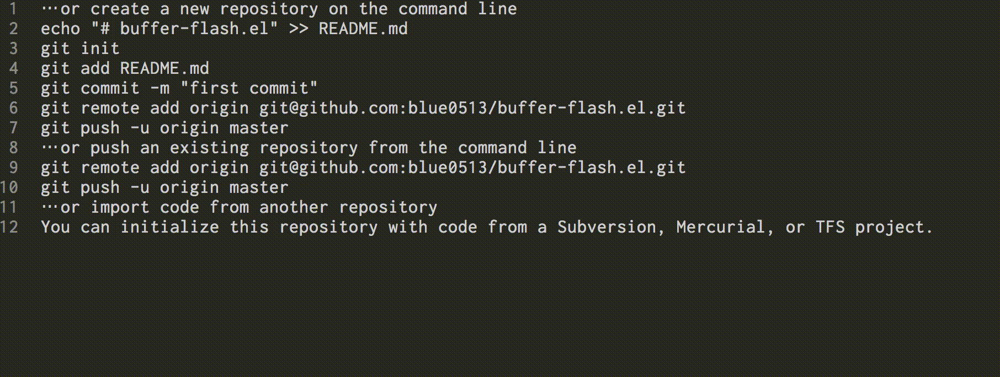

# Buffer Flash

A simple package for flashing the current buffer.



## Setup

```el
;; write the code as bellow in your init.el
(add-to-list 'load-path "/path/to/buffer-flash")
```

## Usage

You can just execute commands bellow.

### flash-background

### flash-foreground
